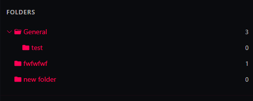
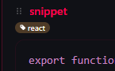
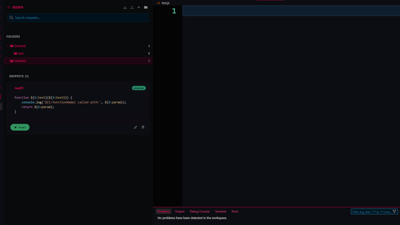
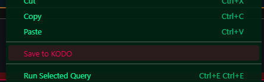
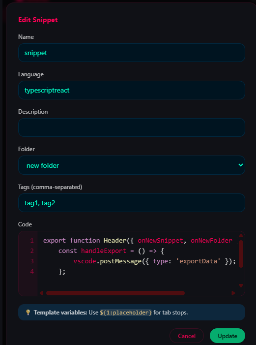

# KODO — Code Snippet Manager

> Save, organize, and instantly reuse code snippets right from your editor sidebar.

## ✨ Features

### 📁 Folder Organization
Create nested folders to keep your snippets organized by project, language, or category.



### 🏷️ Tag System
Add color-coded tags for cross-cutting categorization. Filter your snippet library by tag with one click.



### 🔍 Instant Search
Search across snippet names, code content, descriptions, and languages — results update as you type.

### ✨ Syntax Highlighting
Code previews with language-aware syntax highlighting that adapts to your IDE theme.

### 🎯 Drag & Drop
Drag snippets directly from the sidebar into your editor. Rearrange snippet order by dragging.



### 📋 Insert at Cursor
One-click insertion with full **template variable** support — tab through placeholders to fill them in.

### 🖱️ Right-Click Save
Select code in your editor → Right-click → **"Save to KODO"** — saves your selection instantly.



### 📤 Import / Export
Back up your entire snippet collection or share it with teammates as a `.json` file.

### 🎨 Theme Aware
Automatically matches your IDE theme — dark, light, or high contrast. Selection highlights, syntax colors, and UI elements all adapt.

### 📝 Code Editor
Built-in code editor with:
- Auto-indentation and smart bracket closing
- Line numbers with scroll sync
- Syntax highlighting while editing



---

## 🚀 Quick Start

1. **Install** the `.vsix` file (Extensions panel → `⋯` → "Install from VSIX...")
2. **Open KODO** — click the KODO icon in the activity bar (left sidebar)
3. **Save a snippet** — select code in your editor → right-click → *Save to KODO*
4. **Insert a snippet** — click **Insert** on any snippet card, or drag it into your editor
5. **Organize** — create folders and tags to keep your collection tidy

---

## 📐 Template Variables

Use VS Code snippet syntax to create reusable templates with dynamic placeholders:

```javascript
function ${1:functionName}(${2:param}) {
    console.log('${1:functionName} called with:', ${2:param});
    return ${2:param};
}
```

**How it works:**
- `${1:functionName}` — first tab stop with default text "functionName"
- `${2:param}` — second tab stop with default text "param"
- **Same number = linked** — all `${1:...}` spots update together when you type

When you click **Insert**, the snippet engine activates:
1. Cursor highlights `functionName` → type your name → all instances update
2. Press **Tab** → cursor moves to `param` → type your param → all instances update
3. Press **Tab** → done!

### More Examples

**REST API Endpoint:**
```javascript
app.get('/api/${1:resource}/:${2:id}', async (req, res) => {
    const { ${2:id} } = req.params;
    const data = await ${3:Model}.findById(${2:id});
    res.json(data);
});
```

**React Component:**
```jsx
export function ${1:ComponentName}({ ${2:props} }) {
    return (
        <div className="${3:container}">
            <h1>${1:ComponentName}</h1>
            {${2:props}}
        </div>
    );
}
```

---

## 📦 Import & Export

### Export
Click the **↑** icon in the header (or Command Palette → *KODO: Export Snippets*) to save your entire collection as a `.json` file.

### Import
Click the **↓** icon in the header (or Command Palette → *KODO: Import Snippets*) to load snippets from a `.json` file. Imported snippets are **merged** with your existing collection — nothing gets overwritten.

---

## ⌨️ Commands

| Command | Description |
|---|---|
| `Save to KODO` | Save selected code as a snippet (right-click menu) |
| `KODO: Insert Snippet at Cursor` | Pick and insert a snippet via quick pick |
| `KODO: Export Snippets` | Export all snippets to JSON |
| `KODO: Import Snippets` | Import snippets from JSON |

---

## 🔧 Compatibility

Works with **VS Code**, **Cursor**, and **Antigravity**.

---

## 👤 Credits

Created by **[EstarinAzx](https://github.com/EstarinAzx)**

---

## 📄 License

This project is licensed under the [MIT License](LICENSE).

**Enjoy KODO!** 🎉
